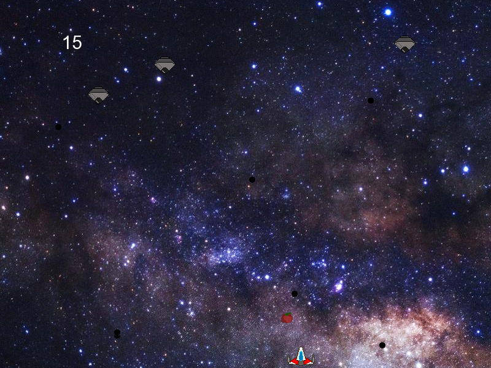

# SpaceMadness :ringed_planet:

#### What is it?
Game inspired by arcade game Space Invaders. Shoot down all the spaceships,
collect fruits for bonus points and stay alive for as long as you can!


Game written in C++ on Linux platform using SFML library.
#### How to build and run?
Game requires SFML library installed. To install SFML:
```
sudo apt-get install libsfml-dev
```

To build and run game just make:
```
make
./SpaceMadness
```

Good Luck!
